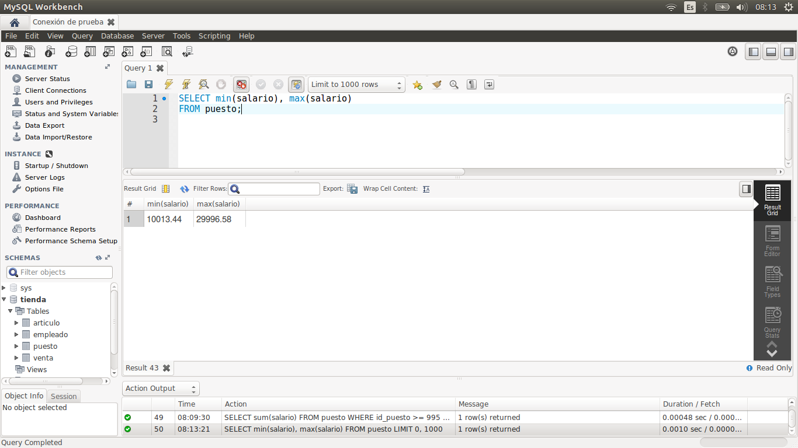
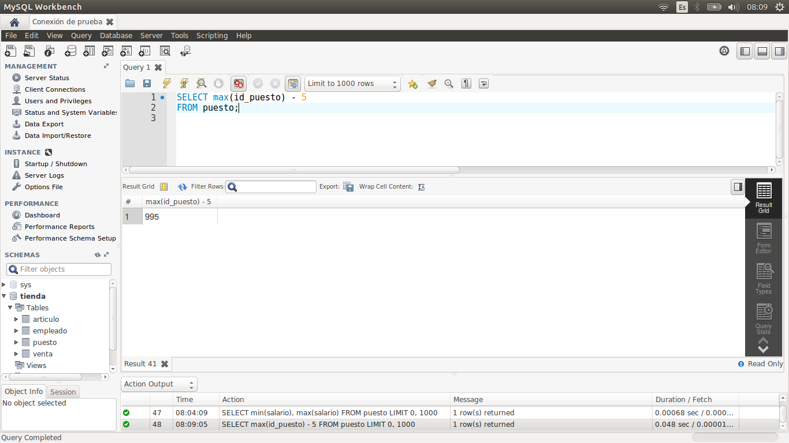

[`Introducción a Bases de Datos`](../../Readme.md) > [`Sesión 02`](../Readme.md) > `Reto 2`
	
## Reto 2: Funciones de agrupamiento

<div style="text-align: justify;">

### 1. Objetivos :dart:

- Escribir consultas que permitan responder a algunas preguntas.

### 2. Requisitos :clipboard:

1. MySQL Workbench instalado.

### 3. Desarrollo :rocket:

Usando la base de datos `tienda`, escribe consultas que permitan responder las siguientes preguntas.

- ¿Cuál es el promedio de salario de los puestos?
- ¿Cuántos artículos incluyen la palabra `Pasta` en su nombre?
- ¿Cuál es el salario mínimo y máximo?
- ¿Cuál es la suma del salario de los últimos cinco puestos agregados?

<details><summary>Solución</summary>
<p>

- ¿Cuál es el promedio de salario de los puestos?

   ```sql
   SELECT avg(salario)
   FROM puesto;
   ```
   

- ¿Cuántos artículos incluyen la palabra `Pasta` en su nombre?

   ```sql
   SELECT count(*)
   FROM articulo
   WHERE nombre LIKE '%pasta%';
   ```
   
   
- ¿Cuál es el salario mínimo y máximo?

   ```sql
   SELECT min(salario), max(salario)
   FROM puesto;
   ```
   
   
- ¿Cuál es la suma del salario de los últimos cinco puestos agregados?

   Primero obtenemos el ídentificador que nos permite saber eso.
   
   ```sql
   SELECT max(id_puesto) - 5
   FROM puesto;
   ```
   
   
   
   Usamos ese identificador ahora.

   ```sql
   SELECT sum(salario)
   FROM puesto
   WHERE id_puesto >= 995;
   ```
   

</p>
</details>

<br/>

[`Anterior`](../Ejemplo-02/Readme.md) | [`Siguiente`](../Readme.md#agrupamientos)      

</div> 
